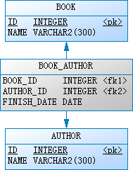

# `Spring Data JPA` 系列 —— 两张表（多对多关联，关联表带扩展字段）

这里通过一个完整的例子展示如何通过 `JPA` 对两张表（多对多关联，关联表带扩展字段）进行增删改查操作。

## 前提

* JDK 8+
* Maven 3+

## 表结构



## 例子

### 创建 Maven 项目

`pom.xml`

```xml
<?xml version="1.0" encoding="UTF-8"?>
<project xmlns="http://maven.apache.org/POM/4.0.0" xmlns:xsi="http://www.w3.org/2001/XMLSchema-instance"
         xsi:schemaLocation="http://maven.apache.org/POM/4.0.0 http://maven.apache.org/xsd/maven-4.0.0.xsd">
    <modelVersion>4.0.0</modelVersion>

    <groupId>org.lewis.demos</groupId>
    <artifactId>jpa-manytomany-extracolumns-springboot-h2</artifactId>
    <version>1.0</version>

    <parent>
        <groupId>org.springframework.boot</groupId>
        <artifactId>spring-boot-starter-parent</artifactId>
        <version>1.5.2.RELEASE</version>
        <relativePath/> <!-- lookup parent from repository -->
    </parent>

    <properties>
        <project.build.sourceEncoding>UTF-8</project.build.sourceEncoding>
        <project.reporting.outputEncoding>UTF-8</project.reporting.outputEncoding>
        <java.version>1.8</java.version>
    </properties>

    <dependencies>
        <dependency>
            <groupId>org.springframework.boot</groupId>
            <artifactId>spring-boot-starter-data-jpa</artifactId>
        </dependency>
        <dependency>
            <groupId>com.h2database</groupId>
            <artifactId>h2</artifactId>
            <scope>runtime</scope>
        </dependency>
        <dependency>
            <groupId>org.springframework.boot</groupId>
            <artifactId>spring-boot-starter-test</artifactId>
            <scope>test</scope>
        </dependency>
    </dependencies>

    <build>
        <plugins>
            <plugin>
                <groupId>org.springframework.boot</groupId>
                <artifactId>spring-boot-maven-plugin</artifactId>
            </plugin>
        </plugins>
    </build>

</project>
```

`src/main/resources/application.properties`

```properties
## DATASOURCE Settings
#spring.datasource.driver-class-name:org.h2.Driver
#spring.datasource.password:demo
#spring.datasource.url:jdbc:h2:tcp://127.0.0.1/~/jpa-h2
#spring.datasource.username:demo
## JPA Settings
spring.jpa.generate-ddl:true
spring.jpa.hibernate.ddl-auto:update
#spring.jpa.hibernate.dialect:org.hibernate.dialect.H2Dialect
spring.jpa.properties.hibernate.format_sql:false
spring.jpa.show-sql:true
```

`src/main/java/hello/Application.java`

```java

```

### 创建实体

`src/main/java/hello/domain/Book.java`

```java
package hello;

import org.springframework.boot.SpringApplication;
import org.springframework.boot.autoconfigure.SpringBootApplication;

@SpringBootApplication
public class Application {

    public static void main(String[] args) {
        SpringApplication.run(Application.class, args);
    }

}
```

`src/main/java/hello/domain/Author.java`

```java
package hello.domain;

import javax.persistence.Entity;
import javax.persistence.GeneratedValue;
import javax.persistence.Id;
import javax.persistence.OneToMany;
import java.io.Serializable;
import java.util.Set;

@Entity
public class Author implements Serializable {

    private static final long serialVersionUID = 1L;

    @Id
    @GeneratedValue
    private Integer id;

    private String name;

    @OneToMany(mappedBy = "author")
    private Set<BookAuthor> bookAuthors;

    public Author() {
        super();
    }

    public Author(String name) {
        super();
        this.name = name;
    }

    public Integer getId() {
        return id;
    }

    public void setId(Integer id) {
        this.id = id;
    }

    public String getName() {
        return name;
    }

    public void setName(String name) {
        this.name = name;
    }

    public Set<BookAuthor> getBookAuthors() {
        return bookAuthors;
    }

    public void setBookAuthors(Set<BookAuthor> bookAuthors) {
        this.bookAuthors = bookAuthors;
    }

    @Override
    public String toString() {
        return String.format("Author [id=%s, name=%s]", id, name);
    }

}
```

`src/main/java/hello/domain/BookAuthor.java`

```java
package hello.domain;

import javax.persistence.*;
import java.io.Serializable;
import java.util.Date;

@Entity(name = "BOOK_AUTHOR")
public class BookAuthor implements Serializable {

    private static final long serialVersionUID = 1L;

    @Id
    @ManyToOne
    @JoinColumn(name = "BOOK_ID")
    private Book book;

    @Id
    @ManyToOne
    @JoinColumn(name = "AUTHOR_ID")
    private Author author;

    @Column(name = "FINISH_DATE")
    private Date finishDate;

    public BookAuthor() {
        super();
    }

    public BookAuthor(Book book, Author author) {
        super();
        this.book = book;
        this.author = author;
    }

    public BookAuthor(Book book, Author author, Date finishDate) {
        super();
        this.book = book;
        this.author = author;
        this.finishDate = finishDate;
    }

    public Book getBook() {
        return book;
    }

    public void setBook(Book book) {
        this.book = book;
    }

    public Author getAuthor() {
        return author;
    }

    public void setAuthor(Author author) {
        this.author = author;
    }

    public Date getFinishDate() {
        return finishDate;
    }

    public void setFinishDate(Date finishDate) {
        this.finishDate = finishDate;
    }

    @Override
    public String toString() {
        return String.format("BookAuthor [book=%s, author=%s, finishDate=%s]", book.getName(), author.getName(), finishDate);
    }

}
```

### 创建 Repository

`src/main/java/hello/repository/BookRepository.java`

```java
package hello.repository;

import hello.domain.Book;
import org.springframework.data.jpa.repository.JpaRepository;

import java.util.List;

public interface BookRepository extends JpaRepository<Book, Integer> {

    Book findByName(String name);

    List<Book> findByNameContaining(String name);

}
```

`src/main/java/hello/repository/AuthorRepository`

```java
package hello.repository;

import hello.domain.Author;
import org.springframework.data.jpa.repository.JpaRepository;

import java.util.List;

public interface AuthorRepository extends JpaRepository<Author, Integer> {

    Author findByName(String name);

    List<Author> findByNameContaining(String name);

}
```

## 单元测试

### 编写单元测试

`src/test/java/hello/BookRepositoryTests.java`

```java
package hello;

import hello.domain.Author;
import hello.domain.Book;
import hello.domain.BookAuthor;
import hello.repository.AuthorRepository;
import hello.repository.BookRepository;
import org.junit.After;
import org.junit.Before;
import org.junit.Test;
import org.junit.runner.RunWith;
import org.springframework.beans.factory.annotation.Autowired;
import org.springframework.boot.test.autoconfigure.orm.jpa.DataJpaTest;
import org.springframework.test.context.junit4.SpringRunner;

import java.util.Arrays;
import java.util.Date;

import static org.assertj.core.api.Assertions.assertThat;

@RunWith(SpringRunner.class)
@DataJpaTest
public class BookRepositoryTests {

    @Autowired
    private BookRepository bookRepository;
    @Autowired
    private AuthorRepository authorRepository;

    @Before
    public void init() {
        Book spring = new Book("Spring in Action");
        Book springboot = new Book("Spring Boot in Action");

        Author lewis = new Author("Lewis");
        Author mark = new Author("Mark");
        Author peter = new Author("Peter");

        BookAuthor springLewis = new BookAuthor(spring, lewis, new Date());
        BookAuthor springMark = new BookAuthor(spring, mark, new Date());

        BookAuthor springbootLewis = new BookAuthor(springboot, lewis, new Date());
        BookAuthor springbootPeter = new BookAuthor(springboot, peter, new Date());

        spring.getBookAuthors().addAll(Arrays.asList(springLewis, springMark));
        springboot.getBookAuthors().addAll(Arrays.asList(springbootLewis, springbootPeter));

        authorRepository.save(Arrays.asList(lewis, mark, peter));
        bookRepository.save(Arrays.asList(spring, springboot));
    }

    @After
    public void deleteAll() {
        // 删除所有书籍和关联关系，但不删除作者
        bookRepository.deleteAll();

        // 删除所有作者，如果书籍和作者存在关联，则删除报错
        authorRepository.deleteAll();
    }

    @Test
    public void findAll() {
        assertThat(bookRepository.findAll()).hasSize(2);

        assertThat(authorRepository.findAll()).hasSize(3);
    }

    @Test
    public void findByName() {
        assertThat(bookRepository.findByName("Spring in Action")).isNotNull();

        assertThat(authorRepository.findByName("Lewis")).isNotNull();
    }

    @Test
    public void findByNameContaining() {
        assertThat(bookRepository.findByNameContaining("Spring")).hasSize(2);

        assertThat(authorRepository.findByNameContaining("e")).hasSize(2);
    }

    @Test
    public void margeBook() {
        Book book = bookRepository.findByName("Spring in Action");
        assertThat(book).isNotNull();

        book.setName("Spring in Action (4th Edition)");

        assertThat(bookRepository.findByName("Spring in Action")).isNull();
        assertThat(bookRepository.findByName("Spring in Action (4th Edition)")).isNotNull();
    }

    @Test
    public void deleteBook() {
        Book book = bookRepository.findByName("Spring Boot in Action");
        assertThat(book).isNotNull();

        bookRepository.delete(book);

        assertThat(bookRepository.findAll()).hasSize(1);
        assertThat(bookRepository.findByName("Spring Boot in Action")).isNull();

        assertThat(authorRepository.findAll()).hasSize(3);
        assertThat(authorRepository.findByName("Peter")).isNotNull();
    }

    @Test
    public void clearAuthor() {
        Book book = bookRepository.findByName("Spring in Action");
        assertThat(book).isNotNull();

        book.getBookAuthors().clear();

        assertThat(bookRepository.findAll()).hasSize(2);
        assertThat(bookRepository.findByName("Spring in Action").getBookAuthors()).isEmpty();

        assertThat(authorRepository.findAll()).hasSize(3);
    }

    @Test
    public void removeAuthor() {
        Book book = bookRepository.findByName("Spring Boot in Action");
        assertThat(book).isNotNull();

        Author author = authorRepository.findByName("Peter");
        assertThat(author).isNotNull();

        book.getBookAuthors().removeIf(bookAuthor -> bookAuthor.getAuthor().equals(author));

        assertThat(bookRepository.findAll()).hasSize(2);
        assertThat(bookRepository.findByName("Spring Boot in Action").getBookAuthors()).hasSize(1);

        assertThat(authorRepository.findAll()).hasSize(3);
        assertThat(authorRepository.findByName("Peter")).isNotNull();
    }

    @Test
    public void removeAllautors() {
        Book book = bookRepository.findByName("Spring in Action");
        assertThat(book).isNotNull();

        book.getBookAuthors().removeAll(book.getBookAuthors());

        assertThat(bookRepository.findAll()).hasSize(2);
        assertThat(bookRepository.findByName("Spring in Action").getBookAuthors()).isEmpty();

        assertThat(authorRepository.findAll()).hasSize(3);
    }

    @Test
    public void plusAuthor() {
        Book book = bookRepository.findByName("Spring in Action");
        assertThat(book).isNotNull();

        Author author = authorRepository.findByName("Jacob");
        assertThat(author).isNull();

        author = new Author("Jacob");
        BookAuthor bookAuthor = new BookAuthor(book, author, new Date());
        book.getBookAuthors().add(bookAuthor);
        authorRepository.save(author);

        assertThat(bookRepository.findByName("Spring in Action").getBookAuthors()).hasSize(3);

        assertThat(authorRepository.findAll()).hasSize(4);
        assertThat(authorRepository.findByName("Jacob")).isNotNull();
    }

    @Test
    public void deleteAuthor() {
        Book book = bookRepository.findByName("Spring Boot in Action");
        assertThat(book).isNotNull();
        bookRepository.delete(book);

        Author author = authorRepository.findByName("Peter");
        assertThat(author).isNotNull();
        authorRepository.delete(author);
        assertThat(authorRepository.findAll()).hasSize(2);
    }

    @Test
    public void deleteAllAuthors() {
        bookRepository.deleteAll();
        assertThat(bookRepository.findAll()).isEmpty();
        assertThat(authorRepository.findAll()).hasSize(3);

        authorRepository.deleteAll();
        assertThat(authorRepository.findAll()).isEmpty();
    }

}
```

### 执行测试用例

```
mvn clean test
```

## 资源

* **源码地址：** https://github.com/lewis007/jpa-manytomany-extracolumns-springboot-h2.git
* **博客地址：** http://blog.csdn.net/lewis_007/article/details/70209556
